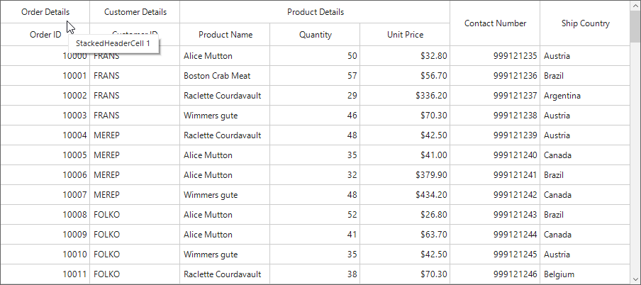

# How to show tooltip for Stacked Headers in WinForms DataGrid (SfDataGrid)?

## About the sample

This sample illustrates how to show tooltip for Stacked Headers in WinForms DataGrid.

[WinForms DataGrid](https://www.syncfusion.com/winforms-ui-controls/datagrid) (SfDataGrid) doesn’t have direct support to show tooltip for the stacked header cell. However you can use [SfToolTip](https://www.syncfusion.com/winforms-ui-controls/tooltip) to show tooltip for the stacked header cells by handling `SfDataGrid.TableControl.MouseMove` event.

```C#

public Form1()
{
    InitializeComponent();

    this.sfDataGrid1.TableControl.MouseMove += OnTableControl_MouseMove;
}


RowColumnIndex hoveredRowcolumnIndex = new RowColumnIndex(-1, -1);
SfToolTip Tooltip = new SfToolTip();


private void OnTableControl_MouseMove(object sender, MouseEventArgs e)
{
    var rowColumnIndex = this.sfDataGrid1.TableControl.PointToCellRowColumnIndex(e.Location, true);
    if (hoveredRowcolumnIndex != rowColumnIndex && rowColumnIndex.RowIndex == 0)
    {
        Tooltip.Hide();
        if (rowColumnIndex.ColumnIndex == 0)
            Tooltip.Show("StackedHeaderCell 1");
        if (rowColumnIndex.ColumnIndex == 1)
            Tooltip.Show("StackedHeaderCell 2");
    }
    else if (rowColumnIndex.RowIndex > 0)
        Tooltip.Hide();
    hoveredRowcolumnIndex = rowColumnIndex;
}


```




## Requirements to run the demo

Visual Studio 2015 and above versions

